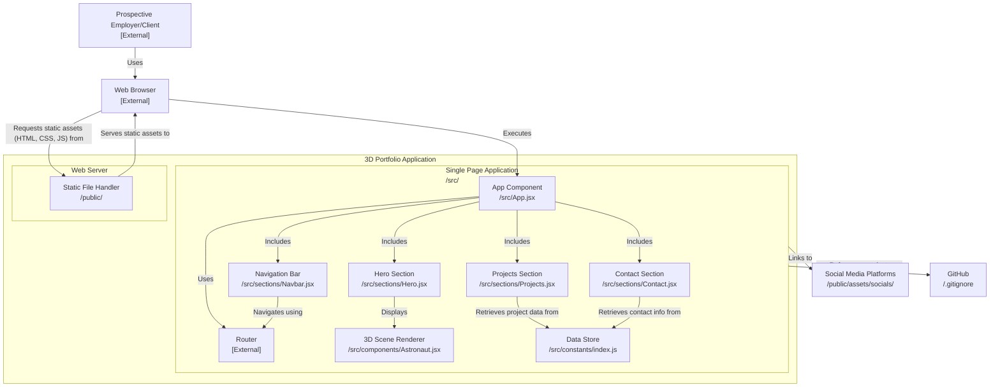

# Unnamed CodeViz Diagram

```mermaid
graph TD

    user["Prospective Employer/Client<br>[External]"]
    browser["Web Browser<br>[External]"]
    socialMedia["Social Media Platforms<br>/public/assets/socials/"]
    github["GitHub<br>/.gitignore"]
    subgraph portfolio_boundary["3D Portfolio Application<br>/"]
        subgraph spa_boundary["Single Page Application<br>/src/"]
            app["App Component<br>/src/App.jsx"]
            router["Router<br>[External]"]
            heroSection["Hero Section<br>/src/sections/Hero.jsx"]
            projectsSection["Projects Section<br>/src/sections/Projects.jsx"]
            contactSection["Contact Section<br>/src/sections/Contact.jsx"]
            navbar["Navigation Bar<br>/src/sections/Navbar.jsx"]
            threeDScene["3D Scene Renderer<br>/src/components/Astronaut.jsx"]
            dataStore["Data Store<br>/src/constants/index.js"]
            %% Edges at this level (grouped by source)
            app["App Component<br>/src/App.jsx"] -->|"Uses"| router["Router<br>[External]"]
            app["App Component<br>/src/App.jsx"] -->|"Includes"| navbar["Navigation Bar<br>/src/sections/Navbar.jsx"]
            app["App Component<br>/src/App.jsx"] -->|"Includes"| heroSection["Hero Section<br>/src/sections/Hero.jsx"]
            app["App Component<br>/src/App.jsx"] -->|"Includes"| projectsSection["Projects Section<br>/src/sections/Projects.jsx"]
            app["App Component<br>/src/App.jsx"] -->|"Includes"| contactSection["Contact Section<br>/src/sections/Contact.jsx"]
            heroSection["Hero Section<br>/src/sections/Hero.jsx"] -->|"Displays"| threeDScene["3D Scene Renderer<br>/src/components/Astronaut.jsx"]
            projectsSection["Projects Section<br>/src/sections/Projects.jsx"] -->|"Retrieves project data from"| dataStore["Data Store<br>/src/constants/index.js"]
            contactSection["Contact Section<br>/src/sections/Contact.jsx"] -->|"Retrieves contact info from"| dataStore["Data Store<br>/src/constants/index.js"]
            navbar["Navigation Bar<br>/src/sections/Navbar.jsx"] -->|"Navigates using"| router["Router<br>[External]"]
        end
        subgraph webServer_boundary["Web Server<br>/public/"]
            staticFileHandler["Static File Handler<br>/public/"]
        end
    end
    %% Edges at this level (grouped by source)
    user["Prospective Employer/Client<br>[External]"] -->|"Uses"| browser["Web Browser<br>[External]"]
    browser["Web Browser<br>[External]"] -->|"Requests static assets (HTML, CSS, JS) from"| staticFileHandler["Static File Handler<br>/public/"]
    browser["Web Browser<br>[External]"] -->|"Executes"| app["App Component<br>/src/App.jsx"]
    staticFileHandler["Static File Handler<br>/public/"] -->|"Serves static assets to"| browser["Web Browser<br>[External]"]
    spa_boundary["Single Page Application<br>/src/"] -->|"Links to"| socialMedia["Social Media Platforms<br>/public/assets/socials/"]
    spa_boundary["Single Page Application<br>/src/"] -->|"References project repositories on"| github["GitHub<br>/.gitignore"]

```
---
*Generated by [CodeViz.ai](https://codeviz.ai) on 9/21/2025, 7:18:34 PM*
